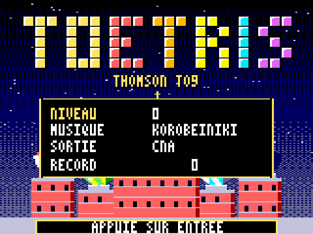
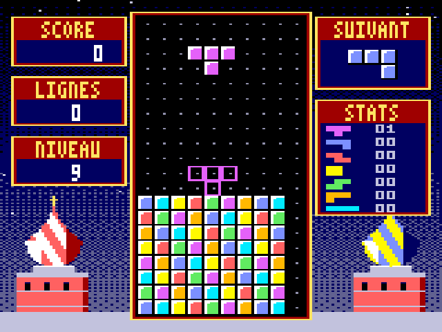

# TOetris — jeu de blocs pour Thomson TO9

*Version « Saint-Basile »*. Un jeu de blocs qui tombent, écrit entièrement en assembleur 6809 pour le **Thomson TO9** (1985). Il reprend les règles de la version Game Boy de 1989 et utilise les graphismes 16 couleurs et le son du TO9. Il a été testé dans l'émulateur [DCMOTO](http://dcmoto.free.fr/), sur la sortie son CNA comme sur le buzzer.

*A falling-blocks game for the Thomson TO9 8-bit computer, hand-written in 6809 assembly (French UI).*

 

> TOetris est un projet amateur, sans lien avec The Tetris Company ni avec Nintendo. Tetris est une marque de The Tetris Company. Le dépôt ne contient aucune donnée issue d'un jeu du commerce : graphismes, musiques et code ont été écrits pour ce projet.

## Jouer

Téléchargez `TOETRIS_TO9.fd` depuis la page [Releases](../../releases).

1. Dans DCMOTO, choisissez la machine **TO9**, puis *Supports amovibles > Disquettes > Charger* `TOETRIS_TO9.fd`.
2. Redémarrez et choisissez **3 - BASIC 128** dans le menu du TO9. Le BASIC 1.0 ne sait pas lire la disquette.
3. Tapez `RUN"TOETRIS"`, ou bien `CLEAR,&H9FFF:LOADM"TOETRIS",,R`.
   Pour la version sans son : `RUN"TOETRIS0"`.

### Menu

*Haut/Bas* choisit la ligne, *Gauche/Droite* change la valeur, *ENTRÉE* lance la partie.

| Ligne | Valeurs |
|---|---|
| NIVEAU | 0 à 9 |
| MUSIQUE | Korobeiniki, Menuet, Ode à la joie ou aucune |
| SORTIE | CNA (convertisseur 6 bits de l'extension jeux) ou BUZZER interne |
| RECORD | meilleur score de la session |

### Commandes

| Touche | Action |
|---|---|
| Gauche / Droite (ou Q / D) | déplacer ; une touche maintenue répète le mouvement |
| Bas (ou S) | descente rapide (1 point par ligne descendue) |
| Haut / ESPACE / A | rotation horaire |
| Z / W / X | rotation anti-horaire |
| ENTRÉE | pause |
| M | couper ou remettre la musique |
| G | afficher ou masquer la pièce fantôme |
| C | inverser la correspondance des couleurs (si elles sont fausses) |
| Manette 1 | directions + bouton (détectée automatiquement) |

### Règles

- Puits de 10 × 20 cases, sans « wall kick ».
- Points : 40 / 100 / 300 / 1200 × (niveau + 1) pour 1 à 4 lignes, plus les points de descente rapide.
- On passe au niveau suivant toutes les 10 lignes, jusqu'au niveau 20.
- Les vitesses du Game Boy (59,7 Hz) sont converties pour les 50 Hz du TO9.

## Reconstruire

Il faut `python3`, [Pillow](https://pypi.org/project/pillow/) et `lwasm` ([lwtools](http://www.lwtools.ca/)).

```sh
cd source
sh build.sh        # -> TOETRIS.BIN, TOETRIS0.BIN (sans son), TOETRIS.fd
```

| Fichier | Rôle |
|---|---|
| `toetris.asm` | le programme 6809 |
| `gfx.py`, `maqlib.py` | graphismes (fonds dessinés par programme, cases, police) → `gfx.asm` |
| `music.py` | musiques et bruitages → `music.asm` |
| `make_fd.py` | fabrique la disquette au format Thomson DOS |
| `test/` | simulateur TO9 et tests |

### Tests

Le dossier `source/test` contient un mini-simulateur TO9 (`to9sim.py`) : processeur 6809 (paquet [MC6809](https://pypi.org/project/MC6809/)), vidéo bitmap 16 couleurs, timer 6846, CNA et clavier.

```sh
pip install pillow MC6809
cd source/test
python3 t_fix.py   # vérifications : affichage, notes justes, lecture des morceaux par le 6809...
python3 t_wav.py   # enregistre chaque musique en WAV
```

### Modifier les musiques

Éditez `source/music.py`. Une note s'écrit `"E5:2"` : nom de la note puis durée, en croches ou en noires selon le morceau. On peut définir des motifs réutilisables avec `pat()`, les appeler avec `C()` et les transposer avec `T()`. Au moment de la construction, le script vérifie que la mélodie et la basse ont bien la même durée.

## Technique

- **Affichage** : mode bitmap 160 × 200 en 16 couleurs (`$E7DC = $7B`), palette de 16 couleurs choisies parmi 4096.
  - Les fonds d'écran sont compressés en LZ avec un découpage optimal : 32 Ko deviennent 7,6 Ko.
  - Un tableau d'état de l'écran permet de ne redessiner que les cases qui changent.
- **Son** : 2 voix carrées (mélodie et basse) plus des bruitages, calculés sous interruption du timer 6846 via le vecteur `TIMEPT` (`$6027`) du moniteur.
  - Au démarrage, le jeu mesure le coût d'une interruption et choisit 2500, 2000, 1667 ou 1250 Hz, ou coupe le son si la machine est trop lente.
  - Si une mélodie est trop aiguë pour la fréquence choisie, elle est jouée entière une octave plus bas.
  - Les morceaux sont écrits sous forme de motifs (appels sur 2 niveaux, transposition), ce qui donne près d'une minute de musique par morceau en quelques centaines d'octets.
- **Mémoire** : programme et données en `$A000-$D9D7`, variables en `$DB10-$DFF7`. L'assemblage échoue si les deux se chevauchent.

Pièges rencontrés, utiles pour d'autres projets TO9 :

- le BASIC 1.0 du TO9 n'a pas le DOS : il faut passer par le BASIC 128 ;
- le DOS Thomson n'utilise que 255 octets par secteur ;
- le moniteur **saute** (`JMP`) vers la routine `TIMEPT` : il faut en sortir par `JMP $E830`, pas par `RTS`.

## Musiques

Ce sont des arrangements originaux d'airs du domaine public :

- **Korobeiniki**, chant populaire russe ;
- **Menuet en sol**, de Christian Petzold (longtemps attribué à J.-S. Bach) ;
- **Ode à la joie**, de Beethoven.

## Licence

[MIT](LICENSE)
